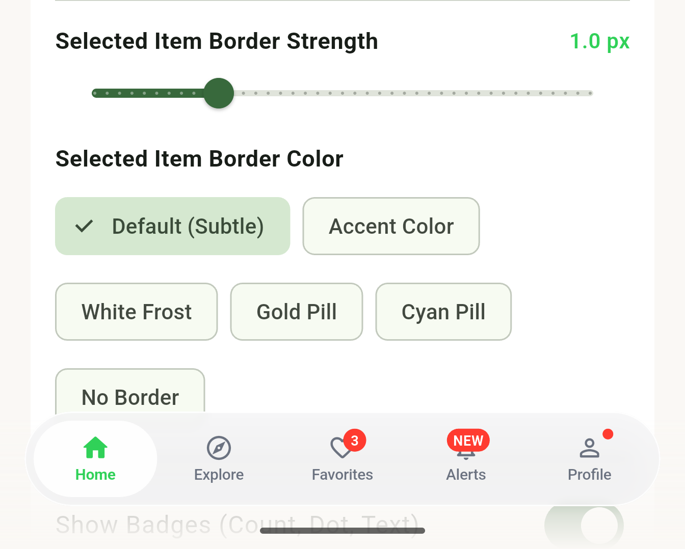
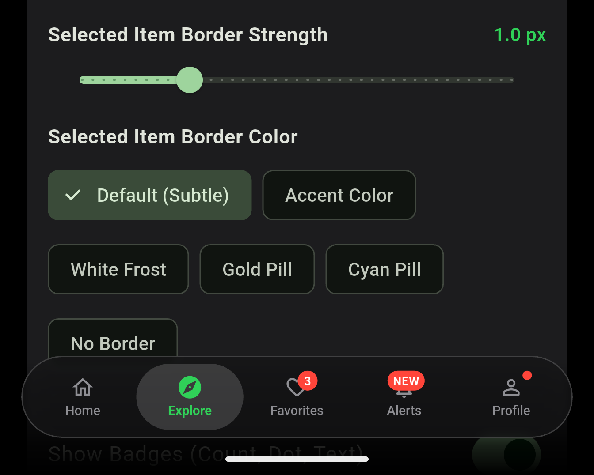

# ios26_bottom_navigationbar

A floating, frosted-glass bottom navigation bar for Flutter, inspired by the visual style of iOS 26.

The package focuses on the details that make a floating navigation bar feel good to use: a smooth sliding selection pill, glass blur, subtle shadows, animated icons, badges, and plenty of control over the styling.

It works across iOS, Android, Web, macOS, Windows, and Linux.

<p align="center">
  
  
</p>

## Features

- Frosted glass background with configurable blur
- Floating pill-shaped navigation bar
- Smooth animated selection indicator
- Active icon scaling animation
- Light and dark theme presets
- Custom colors, borders, shadows, padding, margins, and sizes
- Optional border for the navigation bar and selected item
- Numeric, text, dot, and custom badges
- Different icons for active and inactive states
- Support for `IconData` and custom widgets
- Custom item and indicator builders
- Optional haptic feedback
- Optional ambient fade behind the navigation bar
- Flutter `ThemeExtension` support
- Works with Material, Cupertino, and third-party icon packs
- Cross-platform support

## Platform support

| Platform | Support |
| --- | --- |
| iOS | Yes |
| Android | Yes |
| Web | Yes |
| macOS | Yes |
| Windows | Yes |
| Linux | Yes |

## Getting started

Add the package to your `pubspec.yaml`:

```yaml
dependencies:
  ios26_bottom_navigationbar: ^0.0.2
```

Then import it:

```dart
import 'package:ios26_bottom_navigationbar/ios26_bottom_navigationbar.dart';
```

## Usage

### Using `IOS26NavScaffold`

If you want the complete floating navigation setup, `IOS26NavScaffold` is the easiest option.

It handles the layout for you, including the ambient fade behind the navigation bar.

```dart
import 'package:flutter/material.dart';
import 'package:ios26_bottom_navigationbar/ios26_bottom_navigationbar.dart';

class MyHomeScreen extends StatefulWidget {
  const MyHomeScreen({super.key});

  @override
  State<MyHomeScreen> createState() => _MyHomeScreenState();
}

class _MyHomeScreenState extends State<MyHomeScreen> {
  int _currentIndex = 0;

  @override
  Widget build(BuildContext context) {
    return IOS26NavScaffold(
      body: Center(
        child: Text('Selected index: $_currentIndex'),
      ),
      navigationBar: IOS26BottomNavigationBar(
        currentIndex: _currentIndex,
        onTap: (index) {
          setState(() => _currentIndex = index);
        },
        items: const [
          IOS26NavItem.icon(
            icon: Icons.home_outlined,
            activeIcon: Icons.home_rounded,
            label: 'Home',
          ),
          IOS26NavItem.icon(
            icon: Icons.explore_outlined,
            activeIcon: Icons.explore_rounded,
            label: 'Explore',
          ),
          IOS26NavItem.icon(
            icon: Icons.favorite_outline_rounded,
            activeIcon: Icons.favorite_rounded,
            label: 'Favorites',
            badgeCount: 3,
          ),
          IOS26NavItem.icon(
            icon: Icons.notifications_none_rounded,
            activeIcon: Icons.notifications_rounded,
            label: 'Alerts',
            badgeText: 'NEW',
          ),
          IOS26NavItem.icon(
            icon: Icons.person_outline_rounded,
            activeIcon: Icons.person_rounded,
            label: 'Profile',
          ),
        ],
      ),
    );
  }
}
```

### Using it with a regular `Scaffold`

You don't have to use `IOS26NavScaffold`. The navigation bar can also be used directly with your existing `Scaffold`.

```dart
Scaffold(
  extendBody: true,
  body: MyScrollableContent(),
  bottomNavigationBar: IOS26BottomNavigationBar(
    currentIndex: _selectedIndex,
    onTap: (index) {
      setState(() => _selectedIndex = index);
    },
    items: const [
      IOS26NavItem.icon(
        icon: Icons.home_outlined,
        activeIcon: Icons.home_rounded,
        label: 'Home',
      ),
      IOS26NavItem.icon(
        icon: Icons.search_outlined,
        activeIcon: Icons.search_rounded,
        label: 'Search',
      ),
      IOS26NavItem.icon(
        icon: Icons.person_outline_rounded,
        activeIcon: Icons.person_rounded,
        label: 'Profile',
      ),
    ],
  ),
);
```

## Customizing the borders

Both the outer navigation bar and the selected item indicator have their own border settings.

```dart
IOS26BottomNavigationBar(
  currentIndex: _currentIndex,

  borderColor: Colors.purple.withValues(alpha: 0.5),
  borderWidth: 2.0,

  selectedItemBorderColor: Colors.amber,
  selectedItemBorderWidth: 1.5,

  items: const [
    IOS26NavItem.icon(
      icon: Icons.home_outlined,
      activeIcon: Icons.home_rounded,
      label: 'Home',
    ),
    IOS26NavItem.icon(
      icon: Icons.star_outline,
      activeIcon: Icons.star,
      label: 'VIP',
      selectedBorderColor: Colors.cyanAccent,
      selectedBorderWidth: 2.0,
    ),
  ],
);
```

You can also disable either border by setting its width to `0`:

```dart
IOS26BottomNavigationBar(
  currentIndex: _currentIndex,
  borderWidth: 0,
  selectedItemBorderWidth: 0,
  items: items,
);
```

## Custom icons and widgets

`IOS26NavItem` supports both `IconData` and custom widgets.

For example, you can use SVGs, images, Lottie animations, Rive animations, or your own widgets:

```dart
IOS26NavItem.custom(
  icon: Image.asset(
    'assets/icons/home_outline.png',
    width: 20,
  ),
  activeIcon: Image.asset(
    'assets/icons/home_filled.png',
    width: 20,
  ),
  label: 'Home',
);
```

You can also use any icon package that provides `IconData`, including Material Icons, Cupertino Icons, Lucide, and Font Awesome.

## Badges

There are several ways to add a badge to an item.

### Numeric badge

```dart
IOS26NavItem.icon(
  icon: Icons.notifications_outlined,
  activeIcon: Icons.notifications,
  label: 'Notifications',
  badgeCount: 5,
);
```

### Text badge

```dart
IOS26NavItem.icon(
  icon: Icons.auto_awesome_outlined,
  activeIcon: Icons.auto_awesome,
  label: 'Discover',
  badgeText: 'NEW',
);
```

### Dot badge

```dart
IOS26NavItem.icon(
  icon: Icons.chat_outlined,
  activeIcon: Icons.chat,
  label: 'Messages',
  showBadge: true,
);
```

For more control, you can provide your own badge widget through the `badge` property.

## Styling

The navigation bar can be customized per instance using `IOS26NavThemeData`.

```dart
IOS26BottomNavigationBar(
  currentIndex: _currentIndex,
  onTap: _onTap,
  style: IOS26NavThemeData.light(
    activeColor: const Color(0xFF5B15FC),
    inactiveColor: const Color(0xFF6B7280),
    backgroundColor: const Color(0xFFF6F6F8).withValues(alpha: 0.80),
    indicatorColor: Colors.white.withValues(alpha: 0.94),
    height: 64,
    borderRadius: BorderRadius.circular(40),
  ),
  items: items,
);
```

There are built-in light and dark presets:

```dart
IOS26NavThemeData.light()
IOS26NavThemeData.dark()
IOS26NavThemeData.resolve(context)
```

### Using it with `ThemeData`

`IOS26NavThemeData` is also a `ThemeExtension`, so it can be added directly to your application's theme.

```dart
MaterialApp(
  theme: ThemeData(
    brightness: Brightness.light,
    extensions: [
      IOS26NavThemeData.light(
        activeColor: Colors.deepPurple,
      ),
    ],
  ),
  darkTheme: ThemeData(
    brightness: Brightness.dark,
    extensions: [
      IOS26NavThemeData.dark(
        activeColor: Colors.purpleAccent,
      ),
    ],
  ),
);
```

## API

### `IOS26NavItem`

| Property | Type | Description |
| --- | --- | --- |
| `icon` | `Widget?` | Icon shown when the item is inactive |
| `iconData` | `IconData?` | IconData shorthand for the inactive icon |
| `activeIcon` | `Widget?` | Icon shown when the item is selected |
| `activeIconData` | `IconData?` | IconData shorthand for the active icon |
| `label` | `String?` | Label shown below the icon |
| `customLabel` | `Widget?` | Custom label widget |
| `activeColor` | `Color?` | Active color override |
| `inactiveColor` | `Color?` | Inactive color override |
| `selectedBorder` | `BoxBorder?` | Custom selected-item border |
| `selectedBorderColor` | `Color?` | Selected-item border color |
| `selectedBorderWidth` | `double?` | Selected-item border width |
| `badge` | `Widget?` | Custom badge widget |
| `badgeCount` | `int?` | Numeric badge |
| `badgeText` | `String?` | Text badge |
| `showBadge` | `bool` | Shows a dot badge |
| `badgeColor` | `Color?` | Badge background color |
| `badgeTextColor` | `Color?` | Badge text color |
| `tooltip` | `String?` | Tooltip for accessibility and desktop/web |
| `onTap` | `VoidCallback?` | Item-specific tap callback |

### `IOS26NavThemeData`

Some of the main styling options include:

| Property | Description |
| --- | --- |
| `height` | Navigation bar height |
| `padding` | Internal padding |
| `margin` | Outer margin |
| `borderRadius` | Navigation bar corner radius |
| `blurSigmaX` / `blurSigmaY` | Backdrop blur amount |
| `backgroundColor` | Glass background color |
| `borderColor` | Outer border color |
| `borderWidth` | Outer border width |
| `border` | Full custom outer border |
| `boxShadow` | Floating bar shadow |
| `indicatorColor` | Selected-item pill color |
| `selectedItemBorderColor` | Selected-item border color |
| `selectedItemBorderWidth` | Selected-item border width |
| `selectedItemBorder` | Full custom selected-item border |
| `indicatorBorderRadius` | Selected-item pill radius |
| `indicatorAnimationDuration` | Selection animation duration |
| `indicatorAnimationCurve` | Selection animation curve |
| `activeColor` | Active icon and label color |
| `inactiveColor` | Inactive icon and label color |
| `iconSize` | Icon size |
| `selectedIconScale` | Active icon scale |
| `enableHapticFeedback` | Enables haptic feedback |
| `enableAmbientFade` | Enables the bottom ambient fade |

## Example

The `example/` directory contains a small interactive app demonstrating the navigation bar, including light/dark themes, badges, borders, and different customization options.

You can run it locally with:

```bash
cd example
flutter run
```

## Issues and feature requests

If you find a bug or have an idea for improving the package, please open an issue on the project's GitHub repository.

## License

This package is released under the MIT License. See [LICENSE](LICENSE) for details.